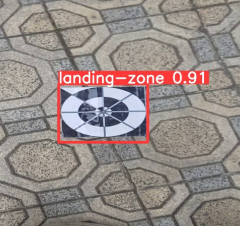

Drone landing detector
==========================

### Description
- A simple model to detect the landing zone for drone.
- My team's term-end project for the course **Image Processing INT3404 2** at UET.

### Group number 12
- Members:
    - [20020099 Lê Xuân Dương](https://www.facebook.com/leduongO19)
    - [21020035 Nguyễn Huy Thái](https://www.facebook.com/huythai855/)
    - [20020398 Vũ Văn Hào](https://www.facebook.com/profile.php?id=100006279257590)
    - [20020392 Cao Hải Đăng](https://www.facebook.com/haidang.uet.2203)
    - [20020041 Nguyễn Văn Khánh Duy](https://www.facebook.com/duytuoiit)

### How to run
- Install dependencies:
    ```bash
    pip install -r requirements.txt
    ```
- Run the scoring program:
    ```bash
    python src/test.py ./test_images ./labels.csv
    ```

### Demo

